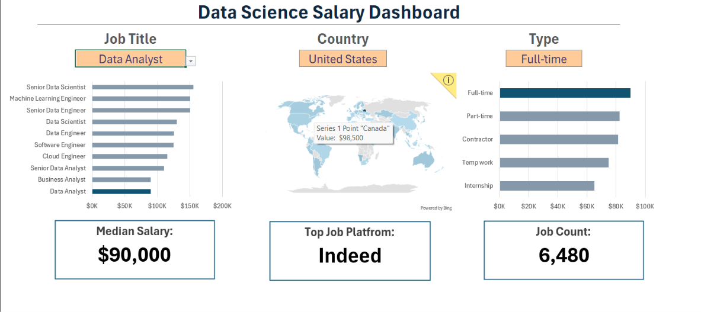
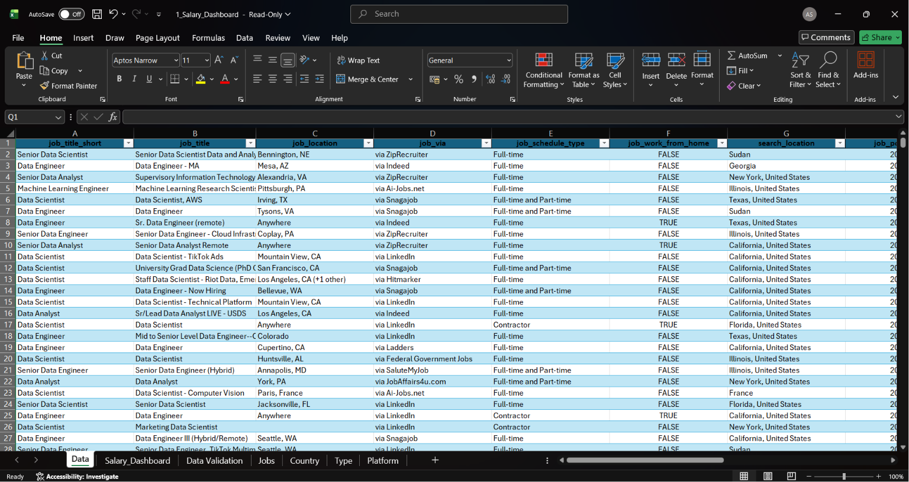

# 📊 Salary Dashboard Analysis in Excel

An interactive Excel dashboard project that explores salary trends in the data industry. This project demonstrates how raw data can be transformed into meaningful insights using Microsoft Excel's dashboarding and data visualization capabilities.

Built as part of my learning journey through Luke Barousse's Excel for Data Analytics course.

---

## 🎯 Project Objective

The objective of this project is to:

* Analyze salary data from data-related careers.
* Create an interactive dashboard for exploring salary trends.
* Present insights through clear and effective visualizations.
* Develop foundational data analytics and business intelligence skills using Microsoft Excel.

---

## 📁 Project Files

```text
📦 Salary-Dashboard-Analysis-Excel
├── 📄 1_Salary_Dashboard.xlsx
└── 📄 README.md
```

---

## 📊 Dashboard Highlights

* Interactive Salary Dashboard
* Salary Trend Analysis
* Data Visualization and Reporting
* Dashboard Navigation using Multiple Sheets
* KPI and Insight Presentation
* User-Friendly Dashboard Design

---

## 📈 Key Questions Explored

* Which data-related roles offer the highest salaries?
* How do salaries vary across different job titles?
* What trends can be identified within the dataset?
* How can dashboards simplify data exploration and decision-making?

---

## 🛠️ Tools & Skills Used

### Tools

* Microsoft Excel

### Skills

* Data Analysis
* Dashboard Design
* Data Visualization
* Business Reporting
* Data Exploration
* Spreadsheet Modeling

---

<h2>📸 Dashboard Preview</h2>

<h3>Dashboard</h3>
<p align="center">
  
</p>

<h3>Dataset</h3>
<p align="center">
  
</p>

---

## 🚀 Key Learnings

Through this project, I learned:

* How to build interactive dashboards in Excel.
* How to organize and analyze real-world datasets.
* How to communicate insights through visualizations.
* The importance of dashboard design and presentation.
* The fundamentals of data analytics using spreadsheets.

---

## 🎓 Course Reference

This project was created while following the **Excel for Data Analytics** course by **Luke Barousse** and recreated independently for practice and portfolio development.

---

## 📬 Connect With Me

If you found this project interesting, feel free to connect with me and check out my other data analytics projects.

⭐ If you like this project, consider giving it a star!
